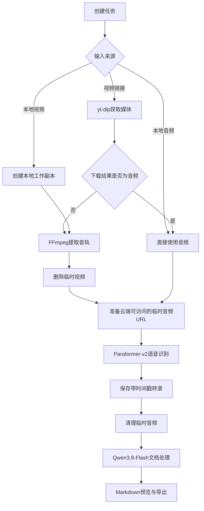
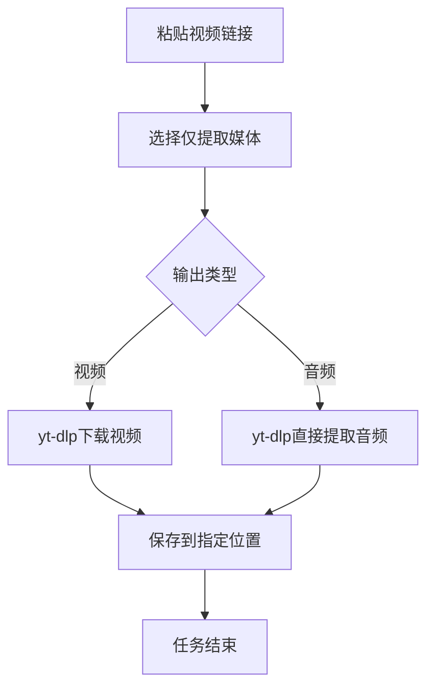

# 基于教学脉络重构的视频学习笔记系统 PRD

> 文档版本：V1.0  
> 产品阶段：MVP 需求定义  
> 文档状态：待评审  
> 目标用户：需要观看技术课程、收听播客并在课后复习的个人用户

## 1. 产品概述

### 1.1 产品名称

暂定名称：教学脉络笔记系统。

### 1.2 产品定位

本产品是一款以纯音频解析为核心的视频学习笔记工具。用户可以粘贴受支持的视频链接，或者选择本地视频、音频文件。系统提取音频后，通过云端语音识别生成带时间戳的转录文本，再调用大语言模型将转录内容处理成 Markdown 笔记。

本产品不以“替用户观看课程”为目标。默认前提是用户已经完整观看或收听过原始内容，生成的笔记用于课后复习、恢复课堂记忆和快速回想老师的讲解过程。

对于技术课程，笔记的重点不是完整还原代码、板书和操作步骤，而是保留课堂中的问题提出、知识铺垫、理解转折、案例解释、常见误区和循序渐进的教学脉络。大语言模型可以补充必要的知识背景，但不能把原课程改写成脱离课堂顺序的标准教材。

### 1.3 核心价值

- 支持视频链接下载和本地媒体导入，减少人工准备步骤。
- 仅上传音频到云端，避免上传完整视频，降低网络与存储成本。
- 自动清理流程中的临时视频和音频，减少本地空间占用与隐私风险。
- 不做简单的“逐字稿压缩”，而是重构内容的讲解顺序与思维演进过程。
- 生成接近真实学生课堂随记的 Markdown 笔记，适合导入 Obsidian 等知识管理工具。
- ASR 与大模型服务均支持自定义 Base URL、API Key 和模型名称，避免绑定单一供应商。

## 2. 背景与问题

现有视频总结工具普遍采用“语音转录—提取要点—生成摘要”的处理方式。这类结果通常能够回答“这节课讲了什么”，但容易丢失以下信息：

- 老师为什么先讲当前内容。
- 前置知识如何铺垫后续概念。
- 老师设置了什么问题或认知冲突。
- 学生可能在哪一步产生困惑。
- 老师使用了什么案例、类比或反例。
- 一个知识点如何自然过渡到下一个知识点。
- 哪些内容被反复强调，哪些是常见误区。

对于已经看过原视频的用户，复习时通常不需要重新获得一份百科式教程，而需要一份能够快速唤醒当时理解过程的“认知骨架”。本产品通过保留时间顺序与教学脉络，解决传统摘要缺乏课堂感、难以唤醒记忆的问题。

## 3. 产品目标与非目标

### 3.1 MVP目标

1. 用户可以通过视频链接或本地文件创建笔记生成任务。
2. 系统能够自动获得音频，并在音频准备完成后删除流程中的临时视频。
3. 本地直接选择音频文件时，跳过音轨分离步骤。
4. 系统能够调用阿里云百炼 `paraformer-v2` 完成长音频转录。
5. 转录结果包含可用于笔记定位的句级时间戳。
6. 系统能够调用 `qwen3.8-flash` 生成 Markdown 文档。
7. 首期提供“技术课程文档”和“播客总结”两种文档处理预设。
8. 用户可以查看任务进度、转录结果、Markdown预览并导出 `.md` 文件。
9. 用户可以自定义ASR与大模型的Base URL、API Key和模型名称。
10. 系统能够安全、可预测地清理下载视频、上传工作副本和临时音频。

### 3.2 非目标

以下能力不纳入MVP：

- OCR识别PPT、板书和代码画面。
- 直接调用多模态模型解析完整视频。
- 完整还原课程项目、文件结构和可运行代码。
- 实时课堂录音与实时字幕。
- 多用户协作、团队空间和权限体系。
- 云端同步用户全部原始视频。
- 移动端App。
- 自动绕过登录、付费墙、DRM或平台访问限制。
- 用户自定义并管理无限数量的文档预设。
- 自动发布到第三方平台。

## 4. 用户与使用场景

### 4.1 核心用户

- 观看Java、Python、Vue3、框架与项目实战课程的开发者或学生。
- 需要在看完课程后沉淀复习笔记的学习者。
- 收听技术、知识或访谈类播客，并希望快速回顾内容的用户。
- 使用Markdown或Obsidian管理学习资料的用户。

### 4.2 核心使用场景

#### 场景A：在线视频生成技术课程笔记

用户粘贴一个受支持的视频链接，选择“生成笔记”和“技术课程文档”。系统通过 `yt-dlp` 获取媒体，优先直接获得音频；如果下载结果是视频，则提取音轨并删除临时视频。完成ASR和文档生成后，用户得到一份按课堂顺序组织的Markdown笔记。

#### 场景B：本地视频生成笔记

用户选择本地MP4文件。系统把文件作为任务输入，在工作目录中处理副本，提取音频后删除工作副本，不直接删除用户电脑上的原始文件。完成识别和文档处理后，用户导出Markdown笔记。

#### 场景C：本地音频生成播客总结

用户选择本地MP3、M4A或WAV文件，并选择“播客总结”。系统检测到输入已经是音频，跳过音轨分离，直接进入ASR和文档处理流程。

#### 场景D：仅提取媒体

用户只希望通过链接下载视频或音频，不生成转录和笔记。用户选择“仅提取媒体”，再选择输出“视频”或“音频”。任务完成后文件保存到用户指定位置，流程结束，不调用ASR和大模型，也不自动删除作为交付结果的文件。

## 5. 产品范围与信息架构

MVP包含以下主要页面或模块：

1. 新建任务。
2. 任务列表。
3. 任务详情与进度。
4. 转录结果。
5. 笔记预览与导出。
6. 模型服务配置。
7. 临时文件与存储设置。

## 6. 核心业务流程

### 6.1 生成笔记主流程



### 6.2 仅提取媒体流程



该流程与“生成笔记”完全隔离：

- 不调用语音识别。
- 不调用大语言模型。
- 不创建转录记录。
- 不生成Markdown笔记。
- 不删除用户明确要求保留的提取结果。

## 7. 功能需求

### 7.1 新建任务

#### 7.1.1 输入方式

用户可以选择：

- 视频链接。
- 本地视频。
- 本地音频。

链接输入要求：

- 支持粘贴单个URL。
- 提交前校验URL格式。
- 使用 `yt-dlp/yt-dlp` 获取媒体及基础元数据。
- 展示可获得时的标题、时长、作者或频道、封面和来源平台。
- 对不支持、需要登录、已删除或存在访问限制的链接给出明确错误提示。

本地文件要求：

- MVP至少支持视频格式：MP4、MKV、WebM。
- MVP至少支持音频格式：MP3、M4A、WAV、FLAC、OGG/Opus。
- 文件选择后显示文件名、格式、大小和时长。
- 不允许仅依据扩展名判断媒体类型，需要读取真实媒体信息。

#### 7.1.2 处理模式

用户必须选择一种互斥模式：

1. 生成笔记。
2. 仅提取媒体。

选择“生成笔记”时，还必须选择文档预设：

- 技术课程文档。
- 播客总结。

选择“仅提取媒体”时，还必须选择输出类型：

- 提取视频。
- 提取音频。

### 7.2 yt-dlp媒体获取

#### 7.2.1 生成笔记模式

- 系统应优先通过 `yt-dlp` 获取质量合适的音频流，避免无必要地下载完整视频。
- 如果来源只能得到视频文件，则下载视频后使用FFmpeg提取音频。
- 音频提取成功且可读取后，立即删除下载产生的临时视频。
- 音频提取失败时不得提前删除视频，确保用户可以重试。
- 保存来源URL、标题、时长和平台信息，用于笔记元数据和来源回看。
- 不将下载的视频作为系统长期资产保存。

#### 7.2.2 仅提取媒体模式

- 用户选择视频时，按照用户指定或系统默认清晰度下载视频。
- 用户选择音频时，优先下载最佳音频流；必要时再从视频中提取。
- 输出文件由用户选择保存位置或保存到默认下载目录。
- 输出文件属于任务交付结果，不执行自动清理。
- 任务完成后不自动进入ASR和文档生成流程。

#### 7.2.3 合规边界

- 产品仅处理用户有权下载和处理的内容。
- 不提供绕过DRM、付费限制或平台权限控制的能力。
- 对需要登录或Cookie的来源，MVP默认提示暂不支持，不自动获取浏览器凭证。
- UI应提示用户遵守内容来源平台条款和版权要求。

### 7.3 本地媒体导入

- 本地文件进入生成笔记流程时，系统可以复制到受管理的工作目录，或使用不会破坏原文件的只读方式处理。
- 音轨提取成功后，只删除系统创建的工作副本。
- 不得默认删除用户选择的原始本地文件。
- 如果未来提供“同时删除原文件”能力，必须单独开关、二次确认并明确展示绝对路径；该能力不进入MVP。
- 用户选择的是音频文件时，跳过视频删除步骤。

### 7.4 音轨提取与预处理

- 使用FFmpeg完成音视频解复用和必要的音频格式转换。
- 保留与原视频一致的时间轴起点，避免后续时间戳整体漂移。
- 推荐转换为适合ASR的16kHz、单声道语音文件，但不得无必要地多次转码。
- 不进行激进的静音删除，因为课堂停顿属于教学节奏信息，并且删除静音会破坏原视频时间戳映射。
- 音频处理后需要校验：文件存在、时长大于0、可正常解码。
- 音频已经符合要求时直接复用，不重复转换。

### 7.5 临时音频托管

长音频ASR服务通常需要能够由云端访问的HTTPS音频URL。因此系统需要提供“临时音频托管层”，负责：

- 接收处理后的音频文件。
- 生成短期有效、不可预测的签名URL。
- 仅允许ASR任务在有效期内读取。
- ASR成功后删除远端临时音频。
- ASR失败时允许在限定时间内重试。
- 超过保留时间后自动清理残留文件。

该能力可以由OSS、兼容S3的对象存储或具备公网访问能力的应用文件服务实现。PRD不强制指定具体供应商。

### 7.6 云端语音识别

#### 7.6.1 默认配置

- 默认服务商：阿里云百炼。
- 默认模型：`paraformer-v2`。
- 调用方式：长音频异步转写。
- 结果要求：完整文本、句级开始时间、句级结束时间。

#### 7.6.2 ASR配置项

设置页需要支持：

- 配置名称。
- Base URL。
- API Key。
- 模型名称，默认 `paraformer-v2`。
- 请求超时时间。
- 任务轮询间隔。
- 是否启用词级时间戳；MVP默认关闭，仅保留句级时间戳。
- 连接测试。

配置要求：

- API Key保存后只显示掩码，不允许页面再次返回完整明文。
- API Key不得写入普通日志、异常堆栈或导出的任务数据。
- Base URL和模型名称允许修改，以支持兼容服务或后续模型迁移。
- 配置变更只影响新任务，不改变已完成任务的历史结果。

#### 7.6.3 转录结果处理

- 保存原始ASR响应，供问题排查使用。
- 归一化为系统统一结构：句子文本、开始时间、结束时间、序号、可选说话人。
- 保留老师的口语顺序，不在ASR阶段进行摘要。
- 可以修正常见标点和明显重复，但不得在转录阶段改变原意。
- 技术术语纠错交由后续大模型结合课程标题和上下文处理。

### 7.7 大模型文档处理

#### 7.7.1 默认配置

- 默认模型：`qwen3.8-flash`。
- 输入：课程或播客元数据、带时间戳转录、所选文档预设。
- 输出：Markdown文本。

#### 7.7.2 LLM配置项

设置页需要支持：

- 配置名称。
- Base URL。
- API Key。
- 模型名称，默认 `qwen3.8-flash`。
- 最大输出Token。
- 温度等基础生成参数。
- 是否开启思考模式；默认根据模型能力使用非思考或低推理强度。
- 请求超时时间。
- 连接测试。

系统通过统一LLM Provider接口调用服务。只要第三方服务兼容系统定义的请求和响应格式，用户可以替换Base URL、API Key和模型名称，例如切换到其他OpenAI兼容模型。

#### 7.7.3 文档处理原则

- 不把完整转录直接压缩成传统摘要。
- 优先识别内容的时间顺序、问题链和思维递进关系。
- 允许大模型补充理解所需的背景知识，但不得虚构老师具体展示过的代码、数据或结论。
- AI补充不能覆盖原始讲解脉络，也不能将笔记重组为与课堂顺序无关的百科教程。
- 重要节点保留视频或音频时间戳。
- 最终文档应自然、简洁，避免论文腔、产品分析报告腔和机械模板感。
- 中间分析结果与最终笔记分离；后台可以深度分析，前台只展示自然的笔记。

### 7.8 文档预设一：技术课程文档

#### 7.8.1 适用内容

- Java、Python、Vue3等编程语言或前端框架课程。
- Spring Boot、MyBatis、Redis等技术框架课程。
- 项目实战、代码演示和开发流程讲解。
- 计算机基础、数据库、网络和操作系统等课程。

#### 7.8.2 处理重点

模型需要优先提取：

- 这部分课程准备解决什么问题。
- 老师为什么先讲当前内容。
- 使用了哪些前置知识。
- 旧方案或直觉理解为什么不够。
- 老师如何通过案例、类比或操作演示展开讲解。
- 学生可能在哪一步产生困惑。
- 老师如何完成纠偏。
- 从当前知识如何过渡到下一个知识。
- 老师反复强调的重点与易错点。
- 最终建立了怎样的理解模型。

#### 7.8.3 输出风格

最终笔记应像认真听课的学生实时记录的笔记：

- 按课堂原始顺序展开。
- 多使用短句、缩进、箭头、对比和提醒。
- 可以使用 `★` 表示重点、`⚠` 表示易错点、`?` 表示疑问、`→` 表示推导。
- 保留少量能够唤醒记忆的关键代码、类名、方法名或命令。
- 不追求完整抄录代码。
- 不把课程改写成标准教材。
- 每个重要脉络节点可以包含 `[回看 00:18:42]`。

#### 7.8.4 推荐文档结构

结构应根据课程实际内容动态生成，不强制每节课包含所有栏目。建议包括：

```markdown
# 课程标题

## 这节课从什么问题开始

## 老师是怎么一步步讲下来的

## 理解发生变化的地方

## 容易混淆或出错的地方

## 关键例子、代码或命令

## 这节课最终建立的思路

## 下课后快速回忆
```

### 7.9 文档预设二：播客总结

#### 7.9.1 适用内容

- 单人知识播客。
- 双人或多人访谈。
- 行业讨论、观点分享和人物对谈。
- 长音频节目或录播访谈。

#### 7.9.2 处理重点

- 本期讨论的核心问题。
- 话题如何展开和转移。
- 不同参与者的主要观点。
- 观点背后的理由、经历和案例。
- 参与者之间的共识与分歧。
- 有启发性的类比、故事或表达。
- 最终结论和尚未解决的问题。
- 值得回听的时间点。

#### 7.9.3 输出风格

- 保留谈话的推进顺序，不只输出主题分类。
- 语言比技术课程笔记更自然，适当保留讨论感。
- 不把不同说话人的观点混在一起；ASR无法可靠区分时，使用“主持人/嘉宾/另一位参与者”等保守表达，或标记待确认。
- 不大段复制原话，只保留对理解有帮助的简短表达。
- 明确区分节目内容和AI补充。

#### 7.9.4 推荐文档结构

```markdown
# 播客标题

## 这期从什么问题聊起

## 讨论是怎么展开的

## 核心观点与理由

## 有意思的案例或故事

## 共识、分歧与没有解决的问题

## 值得回听的片段

## 听完后的快速回忆
```

### 7.10 任务进度与状态

系统需要展示当前阶段，而不是只显示一个总进度条。

标准任务状态：

1. 等待处理。
2. 正在获取媒体。
3. 正在准备音频。
4. 正在删除临时视频。
5. 正在上传临时音频。
6. 正在进行语音识别。
7. 正在处理转录文本。
8. 正在生成Markdown笔记。
9. 正在清理临时文件。
10. 已完成。
11. 已失败。
12. 已取消。

任务详情需要展示：

- 当前阶段。
- 阶段说明。
- 已完成步骤。
- 开始时间和已耗时。
- 错误原因和可执行操作。
- 当前步骤是否可以重试。

### 7.11 失败处理与重试

| 失败环节 | 系统行为 | 用户操作 |
|---|---|---|
| URL解析失败 | 保留输入URL，不创建后续任务 | 修改URL或重新尝试 |
| yt-dlp下载失败 | 保留错误摘要，不调用后续服务 | 重试或更换输入方式 |
| 音轨提取失败 | 暂不删除临时视频 | 重试提取或取消任务 |
| 临时音频上传失败 | 保留本地音频 | 重试上传 |
| ASR提交失败 | 保留音频和配置快照 | 重试ASR |
| ASR任务超时 | 标记超时，不重复创建任务 | 继续查询或重新提交 |
| LLM调用失败 | 保留转录结果，不重复ASR | 重新生成笔记 |
| Markdown生成异常 | 保留模型原始响应 | 重试或导出原始转录 |
| 清理失败 | 任务可以完成，但显示清理警告 | 手动清理或再次尝试 |

重试必须从失败步骤开始，不得无必要地重新下载媒体或重新进行语音识别。

### 7.12 转录与笔记结果

#### 转录结果

- 按时间顺序展示。
- 每段展示开始时间。
- 支持复制全部转录。
- 支持导出纯文本或带时间戳文本。
- MVP允许用户查看转录，但不强制提供全文编辑器。

#### Markdown笔记

- 支持源码视图与渲染预览。
- 支持复制Markdown。
- 支持导出 `.md` 文件。
- 默认文件名采用“内容标题-预设类型.md”。
- 笔记头部记录标题、来源、处理时间、预设和模型信息。
- 来源是在线链接时保留原始URL。
- 时间戳支持转换为可点击来源链接时应生成链接；不支持时展示普通时间文本。
- 支持仅重新生成笔记，不重复进行ASR。

### 7.13 历史任务

- 展示任务标题、输入类型、文档预设、状态、创建时间和时长。
- 可以打开已完成任务的转录与笔记。
- 可以基于已有转录切换预设重新生成笔记。
- 可以删除任务记录及其持久化结果。
- 删除任务前明确列出将删除的转录、笔记和残留临时文件。

## 8. 数据与文件生命周期

### 8.1 文件分类

| 文件类型 | 是否长期保留 | 清理时机 |
|---|---|---|
| URL下载的临时视频 | 否 | 音频提取并校验成功后立即删除 |
| 本地视频原文件 | 是，由用户管理 | 系统不得默认删除 |
| 本地视频工作副本 | 否 | 音频提取并校验成功后删除 |
| 生成笔记流程中的临时音频 | 否 | ASR结果成功保存后删除 |
| ASR失败时的临时音频 | 临时保留 | 重试成功、用户取消或超过保留期后删除 |
| 仅提取媒体的结果文件 | 是 | 由用户管理，系统不自动删除 |
| 原始ASR响应 | 是 | 随任务记录删除 |
| 归一化转录 | 是 | 随任务记录删除 |
| Markdown笔记 | 是 | 用户主动删除 |

### 8.2 默认清理策略

- 临时音频失败保留期默认24小时，可在设置中调整。
- 应用启动时和每日定时扫描过期临时文件。
- 清理操作必须记录文件类型、任务ID和结果，但日志不得记录API Key。
- 清理失败不应造成笔记结果丢失。

## 9. 配置与安全

### 9.1 配置分类

#### ASR配置

- Base URL。
- API Key。
- 模型名称。
- 超时与轮询参数。

#### LLM配置

- Base URL。
- API Key。
- 模型名称。
- 最大输出Token。
- 温度与推理参数。

#### 临时文件配置

- 工作目录。
- 下载结果目录。
- 临时文件保留时长。
- 临时音频托管方式。

### 9.2 安全要求

- API Key必须加密或交由系统安全凭据存储能力保存。
- 前端不得持有可以直接调用云端服务的长期密钥。
- 日志、任务导出、错误详情中不得包含完整密钥。
- 临时音频URL必须短期有效且不可遍历。
- 远端临时音频在ASR完成后应主动删除。
- 本地工作目录需要防止文件名路径穿越和非法覆盖。
- 外部URL需要防止被用于访问内网地址或本地服务。

## 10. 核心数据结构

### 10.1 MediaSource

```json
{
  "id": "source_id",
  "type": "url|local_video|local_audio",
  "sourceUrl": "https://example.com/video",
  "originalName": "lesson-01.mp4",
  "title": "Vue3课程第一节",
  "durationMs": 5400000,
  "mediaType": "video|audio"
}
```

### 10.2 ProcessingTask

```json
{
  "id": "task_id",
  "mode": "generate_note|extract_only",
  "preset": "technical_course|podcast|null",
  "status": "transcribing",
  "currentStage": "asr",
  "sourceId": "source_id",
  "createdAt": "2026-08-31T10:00:00Z",
  "updatedAt": "2026-08-31T10:12:00Z"
}
```

### 10.3 TranscriptSegment

```json
{
  "index": 1,
  "beginTimeMs": 1000,
  "endTimeMs": 6200,
  "text": "今天我们先来看为什么需要状态管理。",
  "speakerId": null
}
```

### 10.4 NoteDocument

```json
{
  "taskId": "task_id",
  "preset": "technical_course",
  "model": "qwen3.8-flash",
  "content": "# Vue3状态管理课程笔记",
  "createdAt": "2026-08-31T10:30:00Z"
}
```

## 11. 非功能需求

### 11.1 性能

- 本地音频提取不应阻塞UI主线程。
- 所有耗时步骤必须作为异步任务运行。
- 单个任务应支持至少5小时的课程音频。
- 用户关闭结果页面后，后台任务仍可继续执行。
- 任务进度应至少每5秒更新一次，或在阶段变化时立即更新。

### 11.2 稳定性

- 下载、上传、ASR轮询和LLM调用均需要超时、有限重试和幂等控制。
- 同一ASR任务轮询不得重复创建云端识别任务。
- 用户重复点击“生成”不得产生重复任务。
- 应用异常退出后，应能够恢复未完成任务或明确标记为中断。

### 11.3 可维护性

- `yt-dlp`、FFmpeg、ASR和LLM必须以独立模块封装。
- ASR使用统一Provider接口，不能在业务逻辑中写死阿里云返回结构。
- LLM使用统一Provider接口，不能在预设中写死特定厂商SDK。
- 文档预设与模型配置分离，后续新增预设无需修改媒体处理模块。
- 文件清理采用统一生命周期管理，不能在各步骤零散删除文件。

### 11.4 可观测性

- 每个任务记录阶段开始、结束、耗时和失败原因。
- 记录云端请求ID，但不记录密钥和完整音频URL。
- 可以区分下载失败、媒体处理失败、ASR失败和LLM失败。
- 统计单任务音频时长、ASR计费时长和LLM Token消耗。

## 12. MVP验收标准

### 12.1 在线视频生成笔记

1. 输入一个 `yt-dlp` 支持的公开视频URL。
2. 系统成功获取音频或从视频中提取音频。
3. 如果产生临时视频，音频校验成功后临时视频被删除。
4. 系统成功调用 `paraformer-v2` 并获得带句级时间戳的转录。
5. ASR成功后临时音频被删除。
6. 系统使用`qwen3.8-flash`生成所选预设的Markdown笔记。
7. 用户可以预览、复制和导出Markdown。

### 12.2 本地视频生成笔记

1. 用户能够选择本地MP4。
2. 系统完成音频提取和后续处理。
3. 系统只删除工作副本，不删除原始MP4。
4. 用户能够获得转录和Markdown笔记。

### 12.3 本地音频生成笔记

1. 用户能够选择本地MP3或M4A。
2. 系统跳过视频下载和音轨分离。
3. 系统直接进入临时托管、ASR和文档生成流程。

### 12.4 仅提取媒体

1. 用户能够输入视频URL并选择“仅提取媒体”。
2. 可以分别选择输出视频或音频。
3. 任务完成后不调用ASR和大模型。
4. 输出文件不会被自动清理。

### 12.5 自定义模型服务

1. 用户可以修改ASR的Base URL、API Key和模型名称。
2. 用户可以修改LLM的Base URL、API Key和模型名称。
3. 配置页可以测试连接。
4. 页面和日志均不会泄露完整API Key。

### 12.6 文档预设质量

技术课程文档需要满足：

- 笔记顺序与课堂讲解顺序基本一致。
- 能识别课程中的问题提出、推导、转折和误区。
- 不输出纯知识点堆砌式摘要。
- 不大段虚构课程中未出现的代码或操作。
- 重要内容带有可核对的时间戳。
- 整体阅读感接近真实学生课堂随记。

播客总结需要满足：

- 保留话题推进顺序。
- 能提取主要观点、理由、案例、共识与分歧。
- 不错误合并不同说话人的立场。
- 标记值得回听的时间点。

## 13. 产品指标

MVP阶段重点观察：

- 媒体获取成功率。
- 音频提取成功率。
- ASR任务成功率与平均完成时间。
- LLM文档生成成功率。
- 单小时课程的ASR费用。
- 单篇笔记的LLM费用。
- 用户重新生成笔记的比例。
- 用户导出Markdown的比例。
- 临时文件自动清理成功率。
- 用户对“能否快速唤醒课堂记忆”的主观评分。

其中最重要的质量指标不是摘要覆盖率，而是：

> 用户看完笔记后，是否能快速恢复老师当时的讲解顺序与自己的理解过程。

## 14. 版本规划

### V1.0：核心闭环

- URL媒体获取。
- 本地视频和音频导入。
- 仅提取媒体。
- FFmpeg音频提取。
- Paraformer-v2转录。
- Qwen3.8-Flash文档处理。
- 技术课程与播客两种预设。
- Markdown预览和导出。
- 模型服务自定义配置。
- 临时文件自动清理。

### V1.1：体验优化

- 转录文本编辑。
- 自定义技术热词。
- 任务并发和队列管理。
- 按已有转录切换模型和预设重新生成。
- 更完善的时间戳来源跳转。
- 成本统计和调用额度提醒。

### V2.0：能力扩展

- 自定义文档预设与Prompt模板。
- 可选的PPT、板书和代码画面OCR。
- 可选的多模态视频理解。
- Obsidian目录直接导出。
- 本地ASR模型与云端ASR切换。
- 更多内容类型预设。

## 15. 关键产品原则

1. **先保存教学脉络，再补充知识。**
2. **后台可以深度分析，前台必须像学生记笔记。**
3. **只上传处理所需的音频，不长期保存原始视频。**
4. **自动清理系统工作文件，不破坏用户原始文件。**
5. **媒体提取与笔记生成是两个相互独立的产品流程。**
6. **模型可以替换，业务流程不能绑定某一个厂商。**
7. **失败后从当前阶段重试，避免重复下载和重复计费。**
8. **知识补全服务于理解，不得覆盖老师原本的讲解顺序。**

## 16. 已确认的MVP决策

- 视频链接下载使用开源项目 [`yt-dlp/yt-dlp`](https://github.com/yt-dlp/yt-dlp)。
- 本地媒体处理使用FFmpeg。
- 默认ASR模型为阿里云百炼`paraformer-v2`。
- 默认文档处理模型为`qwen3.8-flash`。
- ASR与LLM均允许用户自定义Base URL、API Key和模型名称。
- 文档预设首期只提供“技术课程文档”和“播客总结”。
- 生成笔记流程中的视频仅作为临时文件，音频提取成功后删除。
- 已经是音频的输入直接进入ASR，不重复分离。
- “仅提取媒体”流程不进入ASR和LLM处理。
- 本地原始文件不由系统默认删除。

